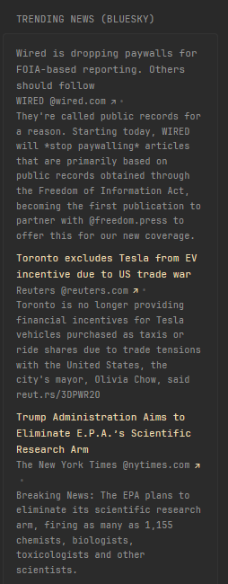

## Screenshots


```yaml
- type: custom-api
  title: Trending News (Bluesky)
  url: >-
    https://public.api.bsky.app/xrpc/app.bsky.feed.getFeed?feed=at://did:plc:kkf4naxqmweop7dv4l2iqqf5/app.bsky.feed.generator/news-2-0
  template: |
    <ul class="list list-gap-10 collapsible-container" data-collapse-after="5">
      {{ range .JSON.Array "feed" }}
        {{ if .String "post.embed.external.title" }}
          <li>
            <a class="size-title-dynamic color-primary-if-not-visited" href="{{ .String "post.embed.external.uri" }}">{{ .String "post.embed.external.title" }}</a>
            <ul class="list-horizontal-text">
              <li>{{ .String "post.author.displayName" }} <a class="visited-indicator" href="https://bsky.app/profile/{{ .String "post.author.did" }}"> @{{ .String "post.author.handle" }}</a></li>
              <li>{{ .String "post.record.text" }}</li>
            </ul>
          </li>
        {{ end }}
      {{ end }}
    </ul>
```

### Notes
- You don't necessarily have to use `at://did:plc:kkf4naxqmweop7dv4l2iqqf5/app.bsky.feed.generator/news-2-0` as your feed but for the sake of simplicity that is hardcoded in and not a variable (if you do use your own feed you may have to change the template as the provided feed only includes Bluesky posts that have URLs)
