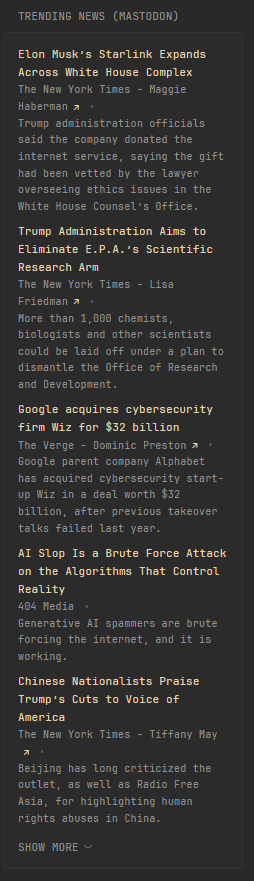

## Preview


```yaml
- type: custom-api
  title: Trending News (Mastodon)
  cache: 3h
  url: 'https://${MASTODON_URL}/api/v1/trends/links'
  template: |
    <ul class="list list-gap-10 collapsible-container" data-collapse-after="5">
      {{ range .JSON.Array "" }}
        <li>
          <a class="size-title-dynamic color-primary-if-not-visited" href="{{ .String "url" }}">{{ .String "title" }}</a>
          <ul class="list-horizontal-text">
            <li>
              {{ .String "provider_name" }}
              {{ if and (.String "author_url") (.String "author_name") }}
                - <a class="visited-indicator" href="{{ .String "author_url" }}">{{ .String "author_name" }}</a>
              {{ end }}
            </li>
            <li>
              {{ .String "description" }}
            </li>
          </ul>
        </li>
      {{ end }}
    </ul>
```

## Environment Variables
- `MASTODON_URL` - Any public [Mastodon](https://joinmastodon.org/) Instance, for example `mastodon.social`
