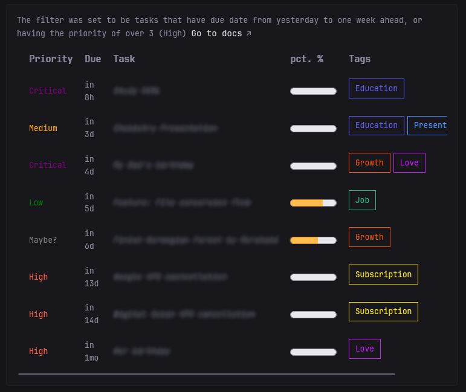
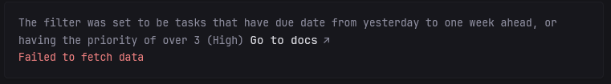

## Screenshots
#### Normal


#### No tags found


```yaml
  - type: custom-api
    title: Tasks
    cache: 5s
    url: http://${VIKUNJA_HOST}:${VIKUNJA_PORT}/api/v1/tasks/all?sort_by=due_date&order_by=asc&per_page=${NUMBER_OF_TASKS}&filter=((due_date>now-1d%26%26due_date<now%2B10d%26%26project!=3)||(due_date>now%26%26priority>3))%26%26done=false
    headers:
        Authorization: Bearer ${VIKUNJA_GLANCE_API_TOKEN}
    template: |
        <div style="overflow-x: auto">
        <p>${VIKUNJA_FILTER_DESCRIPTION} <a class="bookmarks-link color-highlight size-h4" href="http://${VIKUNJA_HOST}:${VIKUNJA_PORT}/api/v1/docs">Go to docs</a></p>
        {{ if eq .Response.StatusCode 200 }}
        <table style="border-spacing: 2rem;">
            <thead>
            <tr style="font-size: 1.5rem; text-align: left;">
                <th>Priority</th>
                <th>Due in</th>
                <th>Task</th>
                <th>pct. %</th>
                <th>Tags</th>
            </tr>
            </thead>
            <tbody>
            {{range .JSON.Array ""}}
                <tr>
                    <!-- Priority -->
                    <td>
                        {{if eq (.Int "priority") 5}}
                            <p style="color: purple">Critical</p>
                        {{else if eq (.Int "priority") 4}}
                            <p style="color: Tomato">High</p>
                        {{else if eq (.Int "priority") 3}}
                            <p style="color: orange">Medium</p>
                        {{else if eq (.Int "priority") 2}}
                            <p style="color: green">Low</p>
                        {{else if eq (.Int "priority") 1}}
                            <p style="color: gray">Maybe?</p>                          
                        {{end}}
                    </td>

                    <!-- Due date -->
                    <td><p {{ .String "due_date" | parseRelativeTime "rfc3339" }}></p></td>

                    <!-- Task name -->
                    <td style="white-space: nowrap; overflow: hidden; text-overflow: ellipsis;"><i>{{ .String "title"}}</i></td>

                    <!-- Percentage done -->
                    <td><meter min="0" max="1" value="{{.Float "percent_done"}}" low="30" high="50" optimum="80" style="min-width: 7vw"></meter></td>

                    <!-- Tags -->
                    <td style="min-width: 10vw; display: flex;">
                    {{if eq (len (.Array "labels")) 0}}
                        <p color="lightgray">No tag</p>
                    {{else}}
                        {{range .Array "labels"}} 
                            <span style="color: #{{.String "hex_color"}}; border: 1px solid #{{.String "hex_color"}}; padding: 0.5rem 1rem; margin-right: 0.5rem;">{{.String "title"}}</span> 
                        {{end}}
                    {{end}}
                    </td>
                </tr>
            {{end}}
            </tbody>
        </table>
            {{ else }}
            <p class="color-negative">Failed to fetch data</p>
            {{ end }}
        </div>
```

## Environment variables

- `NUMBER_OF_TASKS` - The total number of tasks to be displayed. If more tasks suffice the filter, only up to this much will be shown.
- `VIKUNJA_HOST` - The host of the vikunja server, typically when self-hosted, it's at `localhost`
- `VIKUNJA_PORT` - A custom port, else set this to `3456`
- `VIKUNJA_GLANCE_API_TOKEN` - The api token which is used to retrieve tasks. You can create one in `Avatar profile > Settings > API Tokens > Create a token (choose the permission for tasks)`
- `VIKUNJA_FILTER_DESCRIPTION` - User-friendly way to describe your filter, for more filters, see the docs at `http://${VIKUNJA_HOST}:${VIKUNJA_PORT}/api/v1/docs` or [the online version](https://try.vikunja.io/api/v1/docs)


## Tips 

- By default, API tokens will only last for 30 days, to make this infinite, choose `Custom` in the `Expires at` section, and set the year to a gigantic arbitrary number
- Since the filter is URL-encoded, do <b>NOT</b> write plain special character, instead modify it using a [tool](https://www.urlencoder.org/)
- The color of the task's tags correpond to their set color from Vikunja
