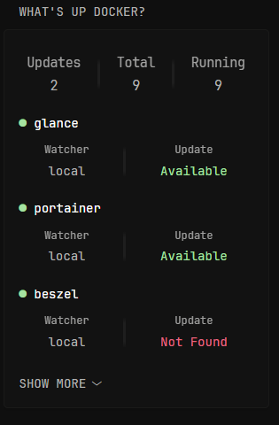

# What's Up Docker Monitor v2.0 - Main
In this version I tried to focus on improving visuals of the widget. I also added overall info and menu. 

[](./wud_main_preview.png)

### Code - Menu
```yaml
{{ $showInfo := true }}       {{/* Show the overall info summary (Updates, Total, Running) */}}
{{ $showList := true }}       {{/* Show the container list section */}}
{{ $showAll := false }}       {{/* Show all containers (not just ones with updates) */}}
{{ $hasUpdates := false }}    {{/* Set this to true to hide up-to-date message  */}}
```
### Widget Code

```yaml
       - type: custom-api
         title: What's Up Docker?
         cache: 1h
         url: http://${WUD_URL}/api/containers
         method: GET
         template: |
          {{/* You are using WUD Monitor v2.0*/}}
          <style>
            .vertical-separator {
              width: 3px;
              height: 3.5rem;
              margin: 0 1rem;
              border-radius: 2px;
              align-self: center;
              background: linear-gradient(
                to bottom,
                transparent,
                rgba(255, 255, 255, 0.05) 20%,
                rgba(255, 255, 255, 0.05) 80%,
                transparent
              );
            }

            .container-info {
              display: flex;
              align-items: flex-start;
              justify-content: space-evenly;
              margin: 1rem 0;
              width: 100%;
            }

            .info-column {
              display: flex;
              flex-direction: column;
              align-items: center;
              min-width: 4rem;
            }

            .info-label {
              font-size: 1.20rem;
              opacity: 0.9;
              text-align: center;
            }

            .info-value {
              font-size: 1.4rem;
              margin-top: 0.25rem;
              text-align: center;
            }
            .info-count {
              font-size: 1.45rem !important;
            }

            /* Container Size: Full */
            @container widget (min-width: 550px) {
              .container-info {
                justify-content: flex-start;
                gap: 2rem;
                padding: 0.5rem;
              }

              .vertical-separator {
                align-self: flex-start;
                margin: 0 2rem;
              }

              .info-column {
                align-items: flex-start;
              }

              .info-label .info-value {
                text-align: left;
              }
            }
          </style>

          {{/* ======================= MENU ======================= */}}
          {{ $showInfo := true }}       {{/* Show the overall info summary (Updates, Total, Running) */}}
          {{ $showList := true }}       {{/* Show the container list section */}}
          {{ $showAll := false }}       {{/* Show all containers (not just ones with updates) */}}
          {{ $hasUpdates := false }}    {{/* Set this to true to hide up-to-date message  */}}

          {{ $containers := .JSON.Array "" }}
          {{ $total := len $containers }}
          {{ $updates := 0 }}
          {{ $running := 0 }}

          {{ range $containers }}
            {{ if .Bool "updateAvailable" }}
              {{ $updates = add $updates 1 }}
            {{ end }}
            {{ if eq (.String "status") "running" }}
              {{ $running = add $running 1 }}
            {{ end }}
          {{ end }}

          {{ if $showInfo }}
            <div class="container-info">
              <div class="info-column">
                <div class="info-label info-count">Updates</div>
                <div class="info-value info-count">{{ $updates }}</div>
              </div>

              <div class="vertical-separator"></div>

              <div class="info-column">
                <div class="info-label info-count">Total</div>
                <div class="info-value info-count">{{ $total }}</div>
              </div>

              <div class="vertical-separator"></div>

              <div class="info-column">
                <div class="info-label info-count">Running</div>
                <div class="info-value info-count">{{ $running }}</div>
              </div>
            </div>
          {{ end }}

          {{ if $showList }}
           <div style="height: 10px;"></div>
            <ul class="list list-gap-10 collapsible-container" data-collapse-after="3">
              {{ range $index, $container := $containers }}
                {{ if $container.Bool "updateAvailable" }}
                  {{ $hasUpdates = true }}
                  <li>
                    <div class="flex flex-column">
                      {{ $registryName := $container.String "image.registry.name" }}
                      {{ $imageName := $container.String "image.name" }}
                      {{ $hubSource := "#" }}
                      {{ if eq $registryName "hub.public" }}
                        {{ $hubSource = concat "https://hub.docker.com/r/" $imageName }}
                      {{ else if eq $registryName "ghcr.public" }}
                        {{ $hubSource = concat "https://github.com/" $imageName }}
                      {{ end }}

                      <div class="size-h4">
                        {{ if eq ($container.String "status") "running" }}
                          <span class="status-dot color-positive">●</span>
                        {{ else }}
                          <span class="status-dot color-negative">●</span>
                        {{ end }}
                        <a class="color-highlight text-truncate" href="{{ $hubSource }}" target="_blank" rel="noreferrer">{{ $container.String "name" }}</a>
                      </div>

                      <div class="container-info">
                        <div class="info-column">
                          <div class="info-label">Watcher</div>
                          <div class="info-value">{{ $container.String "watcher" }}</div>
                        </div>

                        <div class="vertical-separator"></div>

                        <div class="info-column">
                          <div class="info-label">Update</div>
                          <div class="info-value"><span class="color-positive">Available</span></div>
                        </div>
                      </div>
                    </div>
                  </li>
                {{ end }}
              {{ end }}

              {{ if not $hasUpdates }}
                <li class="flex items-center justify-center">
                  <span class="color-positive size-h4">All containers are up to date!</span>
                </li>
              {{ end }}

              {{ if $showAll }}
                {{ range $index, $container := $containers }}
                  {{ if not ($container.Bool "updateAvailable") }}
                    <li>
                      <div class="flex flex-column">
                        {{ $registryName := $container.String "image.registry.name" }}
                        {{ $imageName := $container.String "image.name" }}
                        {{ $hubSource := "#" }}
                        {{ if eq $registryName "hub.public" }}
                          {{ $hubSource = concat "https://hub.docker.com/r/" $imageName }}
                        {{ else if eq $registryName "ghcr.public" }}
                          {{ $hubSource = concat "https://github.com/" $imageName }}
                        {{ end }}

                        <div class="size-h4">
                          {{ if eq ($container.String "status") "running" }}
                            <span class="status-dot color-positive">●</span>
                          {{ else }}
                            <span class="status-dot color-negative">●</span>
                          {{ end }}
                          <a class="color-highlight text-truncate" href="{{ $hubSource }}" target="_blank" rel="noreferrer">{{ $container.String "name" }}</a>
                        </div>

                        <div class="container-info">
                          <div class="info-column">
                            <div class="info-label">Watcher</div>
                            <div class="info-value">{{ $container.String "watcher" }}</div>
                          </div>

                          <div class="vertical-separator"></div>

                          <div class="info-column">
                            <div class="info-label">Update</div>
                            <div class="info-value"><span class="color-negative">Not Found</span></div>
                          </div>
                        </div>
                      </div>
                    </li>
                  {{ end }}
                {{ end }}
              {{ end }}
            </ul>
          {{ end }}
```
