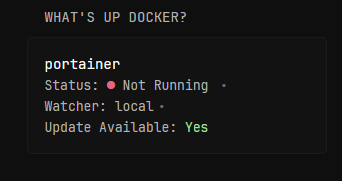
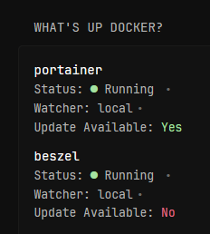

# What's Up Docker Monitor v1.1 - Old

This widget uses the WUD API. It fetches all containers and displays them in Glance. It checks if a container needs an update and displays that information. You can also decide whether you want to toggle displaying all containers or only the ones that need an update.

**Note:** In the v1.1 update, WUD Monitor changed API fetching from `POST` to `GET` because many users complained about long waiting times. If you don’t like this change, you can revert it using the code shown below.  
```txt
url: http://${WUD_URL}/api/containers/watch
method: POST
```
**What’s the difference?** The widget now relies on WUD to update the API instead of forcing it, so updating the information may be slower.

To toggle showing all containers, set the variable `$showAll` to `true`. You can do this by changing the line `{{ $showAll := false }}` in the code to `{{ $showAll := true }}`. Setting it to true also ensures that images needing an update will be displayed on top. This will show all containers, whether they need an update or not.

There’s also a toggle to turn on/off a message indicating that all containers are up to date: `{{ $hasUpdates := false }}`.
```yaml
       - type: custom-api
         title: What's Up Docker?
         cache: 1h
         url: http://${WUD_URL}/api/containers
         method: GET
         template: |
           <ul class="list list-gap-10 collapsible-container" data-collapse-after="3">
             {{ $showAll := false }}  {{/* Set this to true to show all containers */}}
             {{ $containers := .JSON.Array "" }}
             {{ $hasUpdates := false }} {{/* Set to true to hide up-to-date message */}}
             {{ range $index, $container := $containers }}
               {{ if $container.Bool "updateAvailable" }}
                 {{ $hasUpdates = true }}
                 <li>
                   <a class="size-h4 color-highlight block text-truncate" href="https://hub.docker.com/r/{{ $container.String "image.name" }}" target="_blank">{{ $container.String "name" }}</a>
                   <ul class="list-horizontal">
                     <li>Status:
                       {{ if eq ( $container.String "status" ) "running" }}
                         <span class="color-positive">●</span> Running
                       {{ else }}
                         <span class="color-negative">●</span> Not Running
                       {{ end }}
                     </li>
                     <li>Watcher: {{ $container.String "watcher" }}</li>
                     <li>Update Available: <span class="color-positive">Yes</span></li>
                   </ul>
                 </li>
               {{ end }}
             {{ end }}
             {{ if not $hasUpdates }}
               <li><span class="color-positive">You're good to go!</span></li>
             {{ end }}
             {{ if $showAll }}
               {{ range $index, $container := $containers }}
                 {{ if not ( $container.Bool "updateAvailable" ) }}
                   <li>
                    {{ $registryName := $container.String "image.registry.name" }}
                      {{ $imageName := $container.String "image.name" }}
                      {{ $hubSource := "#" }}
                      {{ if eq $registryName "hub.public" }}
                        {{ $hubSource = concat "https://hub.docker.com/r/" $imageName }}
                      {{ else if eq $registryName "ghcr.public" }}
                        {{ $hubSource = concat "https://github.com/" $imageName }}
                      {{ end }}
                      <a class="size-h4 color-highlight block text-truncate" href="{{ $hubSource }}" target="_blank" rel="noreferrer">{{ $container.String "name" }}</a>
                     <ul class="list-horizontal">
                       <li>Status:
                         {{ if eq ( $container.String "status" ) "running" }}
                           <span class="color-positive">●</span> Running
                         {{ else }}
                           <span class="color-negative">●</span> Not Running
                         {{ end }}
                       </li>
                       <li>Watcher: {{ $container.String "watcher" }}</li>
                       <li>Update Available: <span class="color-negative">No</span></li>
                     </ul>
                   </li>
                 {{ end }}
               {{ end }}
             {{ end }}
           </ul>
```
## Environment Variables

`WUD_URL` – The URL of the What's Up Docker server

Template: `WUD_URL=ip:port` – You can also just replace the code variable for it to work.

To grab containers regardless of their state, I also recommend adding this to your WUD environment:

```txt

- WUD_WATCHER_LOCAL_WATCHALL=true

```
Please remember to restart your services after applying environment variables.

## Preview

[](./preview1.png)

[](./preview2.png)

<hr>

**Made by:** Artur Flis  
**Contact:** @blue.dev on the project’s Discord

<hr>

### Contributors v1.1

- [**ᴠᴀʀɪᴀʙʟᴇ**](https://github.com/ralphocdol) – Improved linking of container images directly to their source (Docker Hub or GitHub).
