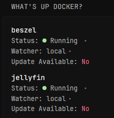

# What's up docker - status
This widget uses WUD api. It fetches all the containers and displayes them in Glance. It checks if container needs an update and displayes it. You can also decided if you want to toggle displaying all the container or only one's that needs an update. 

To toggle showing all containers, you need to set the variable `$showAll` to `true`. You can do this by changing the line `{{ $showAll := false }}` in the code to `{{ $showAll := true }}`.

This will display all containers, regardless of whether they need an update or not.
```
        - type: custom-api
          title: What's up docker?
          cache: 2h
          url: http://{WUD_URL}/api/containers/
          template: |
            <ul class="list list-gap-10 collapsible-container" data-collapse-after="3">
              {{ $showAll := false }}  {{/* # Set this to true to show all containers */}}
              {{ $containers := .JSON.Array "" }}
              {{ range $index, $container := $containers }}
                {{ if or $showAll ( .Bool "updateAvailable" ) }}
                  <li>
                    <a class="size-h4 color-highlight block text-truncate" href="https://hub.docker.com/r/{{ .String "image.name" }}" target="_blank">{{ .String "name" }}</a>
                    <ul class="list-horizontal-text">
                      <li>Status:
                        {{ if eq ( .String "status" ) "running" }}
                          <span class="color-positive">●</span> Running
                        {{ else }}
                          <span class="color-negative">●</span> Not Running
                        {{ end }}
                      </li>
                      <li>Watcher: {{ .String "watcher" }}</li>
                      <li>Update Available: 
                        {{ if .Bool "updateAvailable" }}
                          <span class="color-positive">Yes</span>
                        {{ else }}
                          <span class="color-negative">No</span>
                        {{ end }}
                      </li>
                    </ul>
                  </li>
                {{ end }}
              {{ end }}
            </ul>
```
### Environment variables
`WUD_URL` - the URL of the Whats up docker server

For grabbing container no matter the state I also recommend adding this to your WUD env:
```
- WUD_WATCHER_LOCAL_WATCHALL=true
```
### Preview
[](./preview1.png)

[](./preview2.png)
<hr>
Made by: Artur Flis

Contact: @blue.dev on Discord
