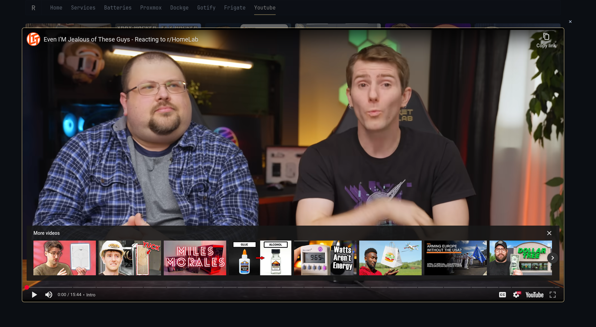

## Using RSS Bridge
This only supports 1 channel unless you use `By playlist` or `By search result` context or if you manage to merge the `items` array.
```yml
- type: custom-api
  title: Youtube
  url: ${RSS_BRIDGE}
  parameters:
    action: display
    bridge: YoutubeBridge
    context: By username
    u: LinusTechTips
    duration_min: 3
    duration_max: nil
    format: Json
  frameless: true
  headers:
    content-type: application/json
  cache: 10m
  template: |
    {{ $arrayList := .JSON.Array "items" }}
    {{ $author := .JSON.String "title" | trimSuffix " - YouTube" }}
    {{ $authorUrl := .JSON.String "home_page_url" | trimSuffix "/videos" }}
    <div class="cards-grid collapsible-container" data-collapse-after-rows="3">
      {{ if eq (len ($arrayList)) 0 }}
      <div>Nothing to show</div>
      {{ else }}
        {{ range $arrayList }}

        {{ $title := .String "title" }}
        {{ $youtubeUrl := .String "url" }}
        {{ $youtubeId := .String "_rssbridge.id" }}
        {{ $youtubeEmbedUrl := concat "https://www.youtube-nocookie.com/embed/" $youtubeId }}
        {{ $timestamp := .String "date_modified" | parseTime "rfc3339" }}
        {{ $thumbnail := findSubmatch "img src=\"([^\"]+)" (.String "content_html") }}
        
        <div class="card widget-content-frame thumbnail-parent">
          <div type="modal" class="modal-no-background">
            <div modal-content>
              <iframe src="{{ $youtubeEmbedUrl }}" loading="lazy" class="iframe-embedded-video"></iframe>
            </div>
            <span>
              {{ if ne $thumbnail "" }}
              
              {{ else }}
              <svg class="video-thumbnail thumbnail" xmlns="http://www.w3.org/2000/svg" fill="none" viewBox="0 0 24 24" stroke-width="1.5" stroke="var(--color-text-subdue)">
                <path stroke-linecap="round" stroke-linejoin="round" d="m2.25 15.75 5.159-5.159a2.25 2.25 0 0 1 3.182 0l5.159 5.159m-1.5-1.5 1.409-1.409a2.25 2.25 0 0 1 3.182 0l2.909 2.909m-18 3.75h16.5a1.5 1.5 0 0 0 1.5-1.5V6a1.5 1.5 0 0 0-1.5-1.5H3.75A1.5 1.5 0 0 0 2.25 6v12a1.5 1.5 0 0 0 1.5 1.5Zm10.5-11.25h.008v.008h-.008V8.25Zm.375 0a.375.375 0 1 1-.75 0 .375.375 0 0 1 .75 0Z" />
              </svg>
              {{ end }}
            </span>
          </div>
          <div class="margin-bottom-widget padding-inline-widget flex flex-column grow">
            <div class="margin-top-10 margin-bottom-auto">
              <a href="{{ $youtubeUrl }}#" class="color-primary-if-not-visited text-truncate-2-lines" target="_blank" rel="noreferrer">
                {{ $title }}
              </a>
            </div>
            <ul class="list-horizontal-text flex-nowrap margin-top-7">
              <li class="shrink-0" {{ $timestamp | toRelativeTime }}></li>
              <li class="min-width-0">
                <a href="{{ $authorUrl }}" class="color-primary-if-not-visited text-truncate-2-lines" target="_blank" rel="noreferrer">
                  {{ $author }}
                </a>
              </li>
            </ul>
          </div>
        </div>
        {{ end }}
      {{ end }}
    </div>
```

Public Instance list: https://rss-bridge.github.io/rss-bridge/General/Public_Hosts.html

## FreshRSS
If you're using [FreshRSS](https://github.com/FreshRSS/FreshRSS) as a backend then replace the top part with

```yml
- type: custom-api
  url: ${FRESHRSS_URL}/api/query.php
  parameters:
    user: yourusername
    f: greader
    t: seeBelowOnHowToGenerateOne
  frameless: true
  title: Youtube
  css-class: widget-no-title
  headers:
    content-type: application/json
  cache: 30m
  template: |
    {{ $arrayList := .JSON.Array "items" }}
    <div class="cards-grid collapsible-container" data-collapse-after-rows="3">
      {{ if eq (len ($arrayList)) 0 }}
      <div>Nothing to show</div>
      {{ else }}
        {{ range $arrayList }}

        {{ $title := .String "title" }}
        {{ $author := .String "origin.title" }}
        {{ $authorUrl := .String "origin.htmlUrl" | trimSuffix "/videos" }}
        {{ $youtubeUrl := .String "canonical.0.href" }}
        {{ $youtubeId := $youtubeUrl | trimPrefix "https://www.youtube.com/watch?v=" }}
        {{ $youtubeEmbedUrl := concat "https://www.youtube-nocookie.com/embed/" $youtubeId }}
        {{ $timestamp := .String "published" | parseTime "unix" }}
        {{ $thumbnail := findSubmatch "img src=\"([^\"]+)" (.String "content.content") }}
        
        <div class="card widget-content-frame thumbnail-parent">
```

### To generate User Queries
1. go to https://your-freshrss-domain.com/i/
2. Select a Category on the left side
3. Select the bookmark icon and choose Bookmark current query see screenshot
4. This will create a query Query n°1
5. Enable sharing by HTML & RSS then Submit
6. Copy `Shareable link to the GReader JSON`

### iframe styling
```css
iframe.iframe-embedded-video {
    outline: 1px solid var(--color-primary);
    outline-offset: 0.1rem;
    border-radius: var(--border-radius);
    width: 100%;
    height: 100%;
    border: none;
    background-color: var(--color-popover-background);
}
```

## YouTube embed proxy
You can replace `https://www.youtube-nocookie.com/embed/` with your instance that supports embedding.

## Modal
There's no native modal in Glance as of v0.7.9, so I made one for now based on popover.

### Modal Usage
```html
<div type="modal">
  <div modal-content>
    <div>Content here</div>
  </div>
  Click me!
</div>
```

### JavaScript
```js
const modalWrapper = document.createElement('div');
modalWrapper.className = 'modal';
modalWrapper.innerHTML = `
    <div class='modal-content'>
        <span class='close'>&times;</span>
        <div class='modal-body'></div>
    </div>
`;
document.body.appendChild(modalWrapper);

const modal = document.querySelector('.modal');
const modalContent = document.querySelector('.modal-content');
const modalBody = document.querySelector('.modal-body');
const closeBtn = document.querySelector('.close');

document.addEventListener('click', (e) => {
  if (e.target.closest('[type="modal"]')) {
    const triggerElement = e.target.closest('[type="modal"]');
    const contentElement = triggerElement.querySelector('[modal-content]');
    
    if (contentElement) {
      modalBody.innerHTML = contentElement.innerHTML.trim();
    }
    
    modal.className = `modal ${triggerElement.className}`;
    
    const width = triggerElement.getAttribute('width') || '90vw';
    const height = triggerElement.getAttribute('height') || '90vh';
    
    switch (triggerElement.getAttribute('size')) {
      case 'theater':
        modalContent.style.width = '80vw';
        modalContent.style.height = '80vh';
        break;
      case 'full':
        modalContent.style.width = '100vw';
        modalContent.style.height = '100vh';
        break;
      default:
        modalContent.style.width = width;
        modalContent.style.height = height;
        break;
    }
    
    modal.style.display = 'flex';
    setTimeout(() => modal.classList.add('show'), 10);
  }
  if (e.target === closeBtn || e.target === modal) {
    closeModal();
  }
});

document.addEventListener('keydown', (e) => {
  if (modal.classList.contains('show') && e.key === 'Escape') {
    closeModal();
  }
});

const closeModal = () => {
  modal.classList.remove('show');
  setTimeout(() => {
      modal.style.display = 'none';
      modalBody.innerHTML = '';
  }, 300);
}
```

### CSS
```css
.modal {
  display: none;
  position: fixed;
  top: 0; left: 0;
  width: 100%; 
  height: 100%;
  justify-content: center;
  align-items: center;
  opacity: 0;
  transition: opacity 0.3s ease;
  z-index: 15;
}

.modal::before {
  content: '';
  position: absolute;
  top: 0; left: 0;
  width: 100%;
  height: 100%;
  background: rgba(0, 0, 0, 0.5);
  opacity: 0;
  transition: opacity 0.3s ease;
}

.modal.show {
  display: flex;
  opacity: 1;
}

.modal.show::before {
  opacity: 1;
}

.modal .modal-content {
  --shadow-properties: 0 15px 20px -10px;
  --shadow-color: hsla(var(--bghs), calc(var(--bgl) * 0.2), 0.5);
  background: var(--color-popover-background);
  border: 1px solid var(--color-popover-border);
  padding: 4.5rem;
  border-radius: 5px;
  animation: modalFrameEntrance 0.3s backwards cubic-bezier(0.16, 1, 0.3, 1);
  box-shadow: var(--shadow-properties) var(--shadow-color);
}

.modal.modal-no-background .modal-content {
  background: none;
  border: none;
  box-shadow: none;
}

.modal.show .modal-content {
  transform: scale(1);
}

.modal .close {
  cursor: pointer;
  font-size: 20px;
  width: 30px;
  height: 30px;
  display: flex;
  align-items: center;
  justify-content: center;
  position: absolute;
  top: 10px;
  right: 10px;
}

.modal .modal-body {
  height: 100%;
}

[modal-content] {
  display: none;
}

[type="modal"] {
  cursor: pointer;
}

@keyframes modalFrameEntrance {
  from {
      opacity: 0;
      transform: translateY(var(--entrance-direction));
  }
}
```